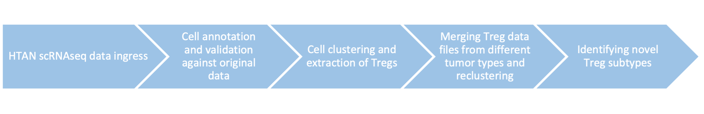
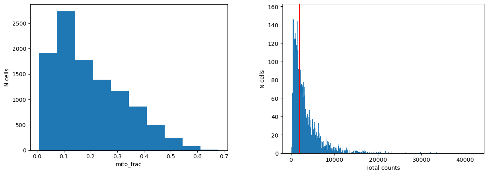
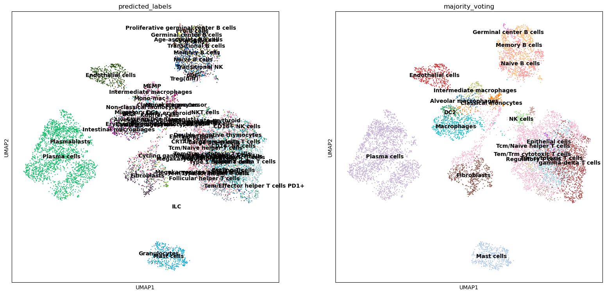
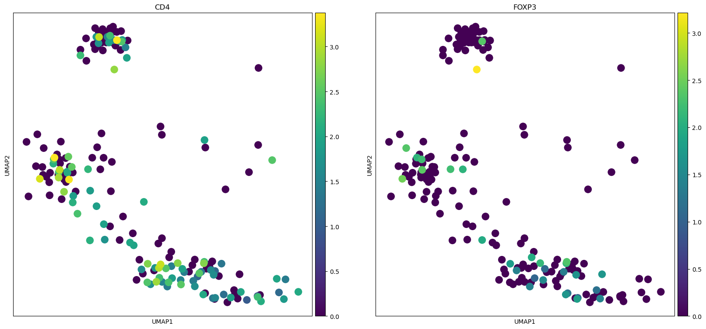
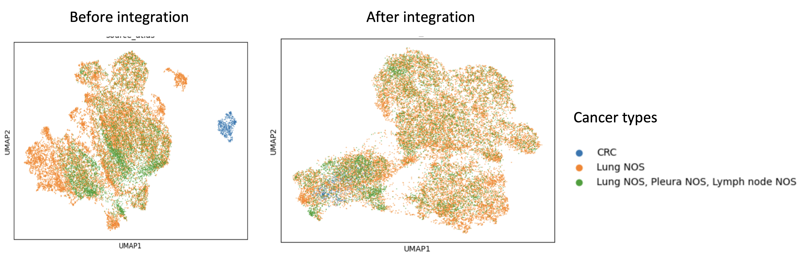

# Pan-cancer-Treg-Atlas
##### HTAN Data Jamboree Nov 6-8, 2024
## Background
Regulatory Tcells (Tregs) are a subset of CD4+ Tcells that overexpress the master transcription factor forkhead box protein P3 (FOXP3) and constitute the main Tcell population with an immunosuppressive profile. Tregs tend to suppress other immune cells in the context of cancer via several mechanisms of immune suppression. Enriching for Tregs has allowed investigators to identify various subtypes of this population but these subpopulations seem to behave differently in humans vs. other animal models and across tissue types [(Togashi et. al, 2019)](https://www.nature.com/articles/s41571-019-0175-7). This has encouraged the development of a Treg atlas that encompasses the diverse molecular profiles that characterize Tregs, but this has been limited by the fact that most Treg studies typically rely on data generated from bulk RNA sequencing which cannot properly capture the subtleties of this cell type. Here, we describe the creation of a Pan-Cancer-Treg Atlas by leveraging single cell databases from the Human Tumor Atlas Network (HTAN). The workflow (Fig.1.) and results are described below.
## Analysis goals
- Selecting relevant single cell databases
- Annotating cell types
- Identifying Tregs in different cancer types
- Integration and clustering analysis
- Deriving novel biological conclusions from generated atlas

## Pipeline and results
**Fig.1.**

**1. Data input**
Single-cell HTAN level 4 data was accessed using synapseclient and downloaded to cbc.sbgenomics as described in the notebook [download-synapse-data.sh](download-synpase-data.sh) to perform processing in a jupyter environment. A list of the datasets used could be found in [htan_manifest.xlsx](htan_manifest.xlsx)

**2. Preprocessing, cell annotation, and clustering**
Single-cell RNAseq data was recovered from HTAN as described above and processed using the pipeline elaborated in the [scrna_extract_tregs.ipynb](scrna_extract_tregs.ipynb) notebook. Briefly, the data was initially quality checked (Fig.2a.) prior to annotation with python-based, CellTypist, for automated cell typing according to references available mainly for human and mouse data. Then, the data is normalized and log transformed to account for 10,000 counts per cell which is used for the creation of UMAP plots (Fig.2b.). CellTypist curates models and ontologies for the annotation of the cells within different clusters. We applied this pipeline on 20 datasets (of which, 7 included Tregs) and confirmed that the plots were consistent with the original processing. We then selectively extracted the Tregs (Fig.2c.) from the different datasets and fed them into the integration pipeline for further downstream processing and comparisons across samples and cancer subtypes. We were utimately able to include 25337 Tregs in our analysis.

**Fig.2a.**

The data shows that the authros have already filtered for cells with mito frac>20% which is consistent with the original manuscript and we can infer from the distribution of th emolecule count that true single cells could be distinguished from empty droplets.

**Fig.2b.**

Clustering of cells from the same dataset reveals various distinct subpopulations of cell types, including Tregs.

**Fig.2c.**

Majority voting can extract Tregs based on expression of CD4 and FOXP3.

**3. Integration**
After extracting the Tregs from our chosen datasets and exporting them as h5ad, the files were merged and processed both in Rstudio and a python enviornment separately as described in the [integrate-h5ads.Rmd](integrate-h5ads.Rmd) and [harmony_integration.ipynb](harmony_integration.ipynb) notebooks. This allows the comparison of outputs from two different algorithms for a more thorough investigation of Tregs. In both approaches, duplicate features were aggregated and metadata was added and merged with the respective objects. Then, we perfromed batch correction using CCA and Harmony integration. This allows us to visualize Treg populations from different datasets in UMAP format as shown in (Fig.3.)

**Fig.3.**

UMAP showing clustering of Tregs from different tumor types.

**4. Downstream analysis**
Following the clustering of our extracted Tregs into distinct subtypes originating from different tumor tissues, the populations could be further segreated based on spiecifc gene expressions. This allows the creation of bubble plots summarizing the gene expression profiles of our extracted Treg populations. We can additionally link this to the metadata allowing us to reveal the frequency of certain profiles in responders vs. non responders for example. We can also conduct additional molecular analyses such as pathway analysis, Tcell receptor (TCR) repertoire profiling, and trajectory analysis.

## Conclusions and future directions
We were successfully able to integrate single-cell Treg data from various datasets derived from HTAN and cluster the distinct populations based on gene expression. We reveal 17 different subclusters originating from several tumor types and resolve the molecular differences that characterize these clusters. This is the first step towards creating our comprehensive pan-cancer-Treg-Atlas describing the intricacies of Tregs in orchestrating the immunosuppressive response in tumor models. In the future, we plan to automate the pipeline for CellTypist to analyze and annotate huge sets of data at once for further downstream clustering and processing. We also hope to include more Treg data in the generated atlas by further analyzing different file types and data levels present in HTAN. We could also include additional processing steps to ensure data purity by filtering out certain contaminating cell types that might not be real Tregs. Moving forward, we could apply our pipeline on visium HD data to include a spatial element revealing tumor-compartment-level differences in Treg gene expression gradients. Ultimately, We hope that this atlas becomes a continuously updated resource for investigators who are interested in the fields of Tregs and immunotherapeutic development.

## Limitations
- Here, we were limited by the use of level 4 HTAN data due to time constraints, ultimately limiting the number of datasets we could use for analysis.
- Filtering the data during the Treg extraction step initially resulted in a cell drop out issue due to some cells not expressing CD4 or FOXP3, but this was addressed with the inclusion of a majority voting step to classify a Treg based on the expression of other markers that properly clustered with the true Treg population.
- We were finally limited by only being able to apply our pipeline on one dataset at a time which resulted in the analysis requiring more time than initially expected.
- We encountered an issue with cell contamination in which one of the clusters included some degree of CD8 expression.

## Team
- Team lead: Benjamin Green, University of Hawaii
- Beata Malachowska, Albert Einstein College of Medicine
- Marissa Lee, Duke University
- Archana Balan, Johns Hopkins University
- Yichun He, Harvard SEAS & Broad Institute
- Abhirami Suresh, Case Western Reserve University
- Elie Abi Khalil, University of Illinois Chicago

